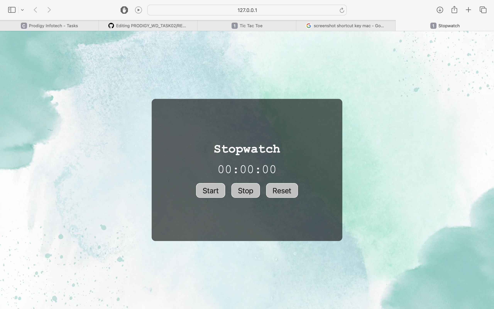

# PRODIGY_WD_02
# Stopwatch Web Application

Welcome to the Stopwatch web application! This simple stopwatch allows you to measure time with precision. It's built using HTML, CSS, and JavaScript.

## Table of Contents

- [Demo](#demo)
- [Features](#features)
- [Technologies Used](#technologies-used)
- [Installation](#installation)
- [Usage](#usage)
- [Contributing](#contributing)
- [License](#license)

## Demo

Check out the live demo of the Stopwatch web application: [Live Demo](#)

## Features

- Start, stop, and reset functionality.
- Precise time measurement.

## Technologies Used

- HTML
- CSS
- JavaScript

